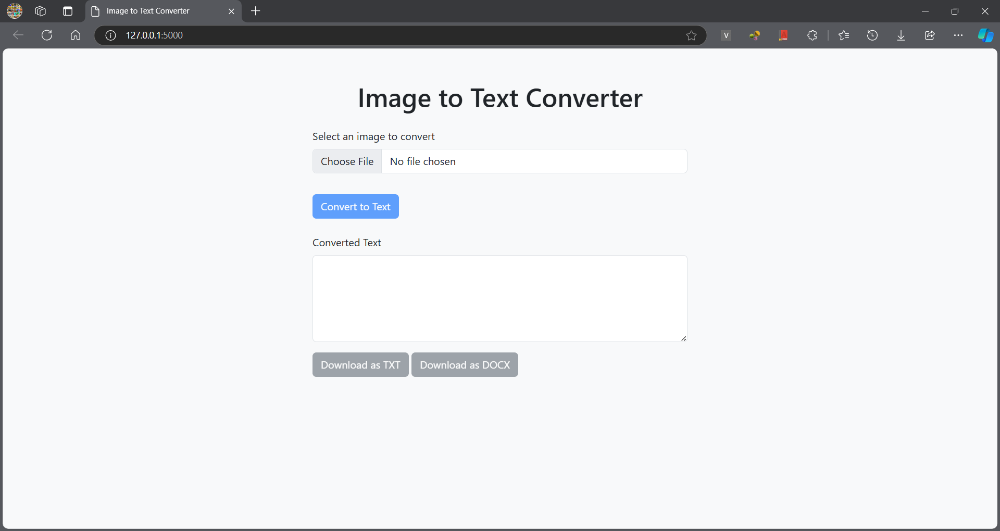

# Image to Text Converter

## Overview

This is a simple tools that converts images to text. You can test the [demo here](https://image-to-text-converter-moue.onrender.com/)

## Tech stack

- Python-Flask for the backend
- HTML, Bootstrap and JavaScript for the frontend

## Features

- [x] Upload images from your computer.
- [x] Save the results as `.txt` or `.docx` file.

## Usage

1. Clone or fork this repository:
   ```
   git clone https://github.com/ainacodes/image-to-text-converter.git
   ```
2. Once you have on your local machine, navigat to the directory:

   ```
   cd image-to-text-converter

   ```

3. Create a new virtual environment:
   ```
   python -m venv venv
   ```
4. Once the virtual environment is created, activate it:
   ```
   venv\Scripts\activate
   ```
5. Install the requirements:
   ```
   pip install -r requirements.txt
   ```
6. Run the flask app
   ```
   python app.py
   ```
7. Open your browser http://127.0.0.1:5000/
   
